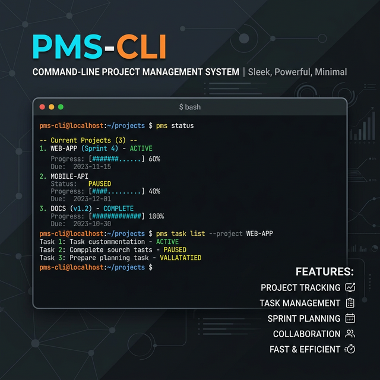

# 🚀 PMS-CLI | Project Management System CLI

<div align="center">



[](https://www.python.org)
[](LICENSE)
[](#)
[](https://www.sqlite.org)
[](https://docs.pytest.org)
[](https://en.wikipedia.org/wiki/Command-line_interface)

</div>

## 📖 Overview
**PMS-CLI** is a robust, interactive, terminal-based Project Management System built entirely in Python. Designed for efficiency and structure, it empowers administrators and users to seamlessly manage teams, coordinate projects, and track tasks directly from the command line, bypassing the overhead of traditional graphical interfaces.

## ✨ Key Features
- **🔐 Secure Authentication**: Integrated user login and registration with hashed password validation and secure session management.
- **👮 Role-Based Access Control**: Highly differentiated views and interactive menus for `admin` and regular users.
- **🏢 Project & Task Lifecycle**: Complete CRUD operations for projects, tasks, and system-wide customizable statuses.
- **👥 Talent Management**: Seamlessly assign and reassign team members, and monitor user workloads.
- **📈 Advanced Analytics**: Admins can fetch real-time metrics, project completion rates, and system health statistics.
- **🛡️ Bulletproof Error Handling**: Deeply nested `try/except` safeguards ensure the CLI never crashes, catching exceptions intelligently and offering precise retry prompts right at the point of failure.
- **🎯 Custom Exception Hierarchy**: Robust exception system with specific error types for authentication, data integrity, business logic, and database operations.
- **📝 Audit Logging**: Complete audit trails for sensitive operations (user management, project modifications, authentication events).

## ⚙️ Installation

1. **Clone the repository:**
   ```bash
   git clone https://github.com/your-username/PMS-CLI.git
   cd PMS-CLI
   ```

2. **Set up a virtual environment (Recommended):**
   ```bash
   python -m venv .venv
   # On Windows:
   .venv\Scripts\activate
   # On macOS/Linux:
   source .venv/bin/activate
   ```

3. **Install dependencies:**
   ```bash
   pip install -r requirements.txt
   ```

## � Core Business Features

### Admin Capabilities
- **👥 User Management**: Create, edit, delete users; assign roles (admin/user)
- **🏢 Project Management**: Full CRUD for projects with customizable status workflows
- **📋 Operational Control**: Assign users to projects, monitor team workloads, reassign personnel
- **⚙️ System Settings**: Define custom project and task status categories
- **📊 Advanced Analytics**: View performance metrics, project completion rates, user statistics, and health indicators

### User Capabilities
- **📝 Task Tracking**: View assigned tasks with status and project context
- **🔄 Task Updates**: Change task status (transitions managed by admin-defined workflows)
- **🔍 Project Exploration**: Search and browse active projects
- **👤 Profile Management**: Update username, email, and password

---

Start the interactive CLI application by executing the main entry point:

```bash
python main.py
```

### 👤 User Roles
- **System Administrator**: Can navigate to the Admin Panel to manage global settings, perform personnel reassignment, oversee operational tasks across all projects, and access rich statistical tables.
- **Standard User**: Can navigate to the Profile Panel to track their assigned tasks, view ongoing personal projects, and interactively update task states.

## 📁 Project Structure

```
PMS-CLI/
├── src/
│   ├── controllers/      # Integration layer (UI ↔ Services)
│   │   ├── auth_controller.py
│   │   ├── user_controller.py
│   │   ├── project_controller.py
│   │   └── task_controller.py
│   ├── services/         # Business logic layer
│   │   ├── auth_services.py
│   │   ├── user_services.py
│   │   ├── project_services.py
│   │   └── task_services.py
│   ├── models/           # Data models & persistence
│   │   ├── base.py
│   │   ├── user_models.py
│   │   ├── project_models.py
│   │   ├── task_models.py
│   │   ├── sessions.py
│   │   └── create_tables.py
│   ├── ui/cli/           # CLI presentation layer
│   │   ├── base.py       # Base UI components (tables, forms, messages)
│   │   ├── auth/         # Authentication views
│   │   ├── user/         # User profile views
│   │   ├── admin/        # Admin management views
│   │   │   ├── users_management.py
│   │   │   ├── projects_management.py
│   │   │   ├── projects.py
│   │   │   ├── operationals.py
│   │   │   ├── settings.py
│   │   │   ├── stats.py
│   │   │   └── admin_view.py
│   │   ├── form/         # Interactive forms
│   │   └── menu/         # Menu handlers
│   └── core/
│       ├── exceptions.py  # Custom exception hierarchy
│       ├── logging.py     # Audit & error logging
│       └── setting.py     # Configuration
├── utils/
│   ├── validators.py      # Input validation functions
│   ├── security.py        # Password hashing/verification
│   └── helpers.py         # Utility functions
├── tests/                 # Test suite (pytest)
├── data/                  # SQL script files
├── main.py                # Application entry point
├── requirements.txt       # Python dependencies
└── README.md              # This file
```

---

The codebase relies on a robust suite of unit and integration tests powered by `pytest`. To execute the entire test suite and verify core functionality:

```bash
pytest tests/
```

## 📦 Dependencies

**Core Dependencies:**
- `Argon` - Secure password hashing
- `tabulate` - ASCII table generation for CLI output
- `pytest` - Testing framework
- `python-dotenv` - Environment variable management (optional)
- Python 3.12+

See `requirements.txt` for the complete list.

## 🏗️ Architecture

This project strictly adheres to a layered **Model-View-Controller (MVC)** architectural pattern optimized for standard input/output:
- **`src/models/`**: Manages data representation and implements the JSON local persistence layer.
- **`src/services/`**: Encapsulates powerful business logic, data generation, and internal system interactions.
- **`src/controllers/`**: Acts as intermediaries, mapping UI data flows to service logic while raising custom validations.
- **`src/ui/cli/`**: Contains deeply nested view layers, rendering menus, dynamic ASCII tables (`BaseTables`), and form prompts.
- **`src/core/`**: Houses the project's standardized custom exceptions (`exceptions.py`), logging (`logging.py`), settings (`setting.py`), and structural data validators.

### Exception Hierarchy 🎯
The project implements a comprehensive custom exception system:

```
ProjectsError (Base Exception)
├── ModelsError (Database Layer)
│   ├── DataIntegrityError (User-fixable errors)
│   │   ├── UniqueError
│   │   ├── NotnullError
│   │   ├── ForeingKeyError
│   │   └── CheckError
│   └── DatabaseSystemError (Technical errors)
│       └── DatabaseLockedError
├── BussinesError (Business Logic Layer)
│   ├── AuthenticactionError
│   │   ├── EmailError
│   │   ├── PasswordError
│   │   ├── PasswordMatchError
│   │   ├── HashCreatingError
│   │   └── HashInvalidError
│   ├── DataNotFoundError
│   │   ├── NotFoundTaskError
│   │   ├── NotFoundTaskStatusError
│   │   ├── NotFoundProjectError
│   │   ├── NotFoundStatusProjectError
│   │   └── NotFoundUserError
│   ├── DataExistsError
│   │   ├── ProjectsExistsError
│   │   └── StatusExistsError
│   └── DataEmptyError
│       └── EmptyFieldsError
```

**All exceptions are properly caught and handled at the UI layer** with contextual error messages and user recovery prompts.

### Data Flow Example
```
User Input (CLI Forms)
    ↓
Controller (Validation)
    ↓
Service (Business Logic)
    ↓
Model (Database Operations)
    ↓
Exception Handling → User-Friendly Error Message
    ↓
Recovery Prompt → Retry or Abort
```

## 🔒 Security

### Authentication & Authorization
- **Password Security**: Passwords are hashed using industry-standard bcrypt algorithm before storage.
- **Session Management**: Secure session handling with user state tracking (role, ID, login status).
- **Role-Based Access Control**: Strict enforcement of admin vs. user permissions across all views.

### Data Integrity
- **Input Validation**: Comprehensive validation at controller layer prevents malformed data from reaching services.
- **Database Constraints**: SQLite constraints (UNIQUE, NOT NULL, FOREIGN KEY, CHECK) ensure data consistency.
- **Transaction Safety**: Database operations are wrapped in try-except blocks to prevent partial state corruption.

### Logging & Audit Trails
- **Security Logging**: All authentication attempts are logged (success/failure).
- **Audit Logging**: User actions (profile modifications, deletions, role changes) are recorded with timestamps.
- **Error Logging**: Technical errors are logged separately for debugging and monitoring.

### Error Handling
- **Exception Safety**: All exceptions are properly caught and handled, preventing information leakage.
- **User-Friendly Messages**: Technical errors are masked with user-friendly messages in the CLI.
- **Recovery Mechanisms**: Failed operations prompt users to retry with context-aware suggestions.

## 🔧 Development Notes

### Code Quality Standards
- **Exception Handling**: Custom exception hierarchy ensures type-safe error handling across all layers.
- **Audit Trail**: Sensitive operations are logged with user context and timestamps.
- **Validation**: Multi-layer validation (UI → Controller → Service) prevents invalid state.
- **Testing**: Comprehensive test coverage for controllers, services, and validators.

### How to Extend

1. **Add a new exception**: Define it in `src/core/exceptions.py` following the hierarchy.
2. **Add a new service method**: Implement in the appropriate service file, return custom exceptions.
3. **Handle in controller**: Validate inputs and pass to service, let exceptions bubble up.
4. **Handle in view**: Catch specific exceptions and display user-friendly messages.

---
<p align="center"><i>A scalable, production-ready command-line project management utility.</i></p>

<div align="center">

**⭐ If you find this project useful, consider giving it a star on GitHub ⭐**

LeoDev2p - Development

</div>

</div>